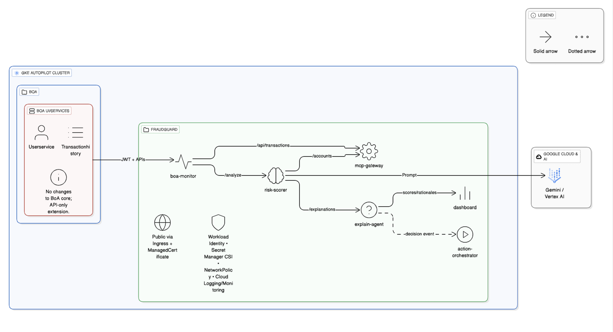
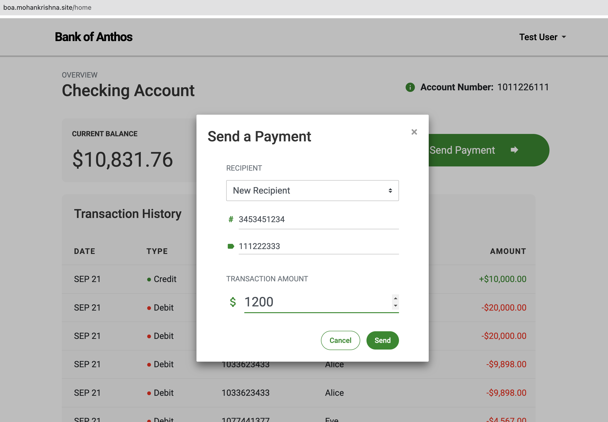
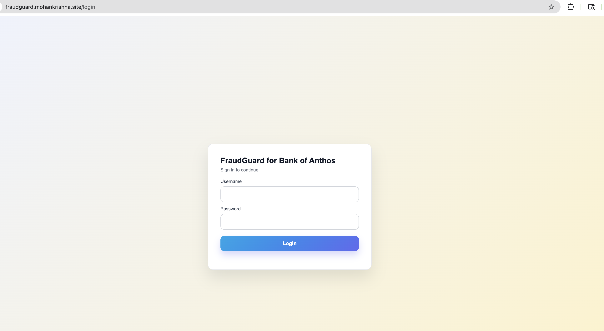
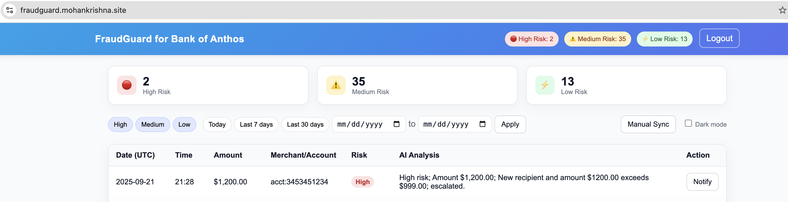

# FraudGuard on GKE — Bank of Anthos (API-only extension) using Gemini/Vertex AI

**One-liner:** Agentic fraud risk analysis for **Bank of Anthos** on **GKE Autopilot** using **Gemini / Vertex AI** — **no BoA core changes**.
**Same cluster:** namespaces **`boa`** (BoA) and **`fraudguard`** (FraudGuard).

## Problem
Real-time fraud detection needs velocity/deviation/recipient analysis without disrupting users or modifying core banking services.

## Solution
FraudGuard ingests BoA transactions via read-only APIs, applies **Gemini/Vertex AI** (with a small RAG window over recent history), and surfaces a **read-only** risk dashboard (High / Medium / Low). **No changes to BoA core; API-only integration.**

**Links**
- 🎥 **Submission video (≤ 3 min):** _ADD PUBLIC LINK HERE_
- 🌐 **Dashboard:** https://fraudguard.mohankrishna.site/  *(user/pass: `admin` / `admin`)*
- 🏦 **BoA (demo):** https://boa.mohankrishna.site/
- 📘 **Technical details:** [TECHNICAL.md](./TECHNICAL.md)
- 📄 **Medium Post:** [medium.com/@mohankrishna](https://medium.com/@mohanalavala68/fraudguard-on-gke-an-api-only-agentic-fraud-layer-for-modern-banking-bank-of-anthos-2472e049a18d)
- 📄 **LinkedIn Post:** [Linkedin](https://lnkd.in/p/g-yvaMa8)

---

## What it does (30-sec read)
- Reads BoA transactions via **JWT + APIs**, normalizes, and posts to the pipeline.
- Scores risk with **Gemini/Vertex AI** using recent history for velocity, deviation, and recipient patterns.
- Explains each decision and displays **High / Medium / Low** on a **read-only** dashboard.
- **action-orchestrator** centralizes action execution (notify/step-up/hold/allow) and isolates BoA API calls.

**Core components:** `boa-monitor → mcp-gateway → risk-scorer → explain-agent → dashboard` (+ optional `action-orchestrator`).
**Security/ops:** Workload Identity, Secret Manager CSI, NetworkPolicy, non-root containers, Managed Certs, Cloud Logging/Monitoring.

---

## Components on GKE (brief)
- **mcp-gateway** — ingest & history APIs for services/UI
- **boa-monitor** — authenticates to BoA, fetches history, forwards events
- **risk-scorer** — Gemini/Vertex AI analysis with RAG over recent **N** (default 50). Default model via Helm: gemini-2.5-flash
- **explain-agent** — rationale/audit store
- **action-orchestrator** — executes actions (notify/step-up/hold/allow); isolates BoA API calls; returns ActionResult
- **dashboard** — Flask UI; tri-level risk (read-only)

## AI models used (brief)
- **Gemini 2.5 Flash** (Generative Language API) and/or **Vertex AI** (configurable)
- RAG over the **last 50** transactions by default (pattern/velocity/recipient signals)

## Optional components (used)
- **MCP-style gateway** for discoverable service tools/endpoints
- **A2A service-to-service** calls inside the cluster, restricted by **NetworkPolicies**
> Details, commands, and toggles are in **TECHNICAL.md**.

---

## Quickstart (≤ 5 minutes)
1. Open **BoA** and make a transfer: https://boa.mohankrishna.site/
2. Open **FraudGuard dashboard**: https://fraudguard.mohankrishna.site/ *(user/pass: `admin` / `admin`)*
3. See the bucket update (**High / Medium / Low**) and rationale text.
4. Need deploy/env/API details? See **[TECHNICAL.md](./TECHNICAL.md)**.

---
## Quicktest

Quick ways to validate end-to-end using the real Bank of Anthos UI and the FraudGuard dashboard. Please use your BoA demo user for login.

1) New recipient transaction (expect HIGH if amount > $999)
Steps
- Log in to BoA and create a transfer to a recipient you have never paid before (new label/account)
- Amount: pick > $1,000 (e.g., $1,100)
- Wait ~15–30s for ingest; if needed, click Manual Sync in the dashboard or call MCP Gateway POST /api/manual-sync
Expected
- Risk: High (score ≥ 0.8)
- Rationale includes: "New recipient and amount $X exceeds $999.00; escalated."
- Logs: risk-scorer emits event=rule_escalation_applied rule=new_recipient_amount_fastpath; no PII in logs

2) Existing recipient with large deviation (expect HIGH if amount ≥ 9× typical)
Prepare
- Send 2–3 small transfers to the SAME recipient (e.g., $100–$200) to establish a typical amount
Test
- Send a much larger transfer to the same recipient (≥ 9× typical; e.g., $2,000 if typical ~$200)
Expected
- Risk: High (score ≥ 0.8)
- Rationale includes: "Amount $X is N× higher than typical $T (recipient/account); escalated."
- Logs: risk-scorer event=rule_escalation_applied rule=amount_vs_typical_fastpath (or amount_vs_typical)

---
## Architecture

> BoA (`ns: boa`) and FraudGuard (`ns: fraudguard`) run in the **same GKE Autopilot cluster**. Integration is via BoA APIs only; **no core changes**.

---

## Screenshots
- BoA transfer

- FraudGuard login & dashboard

---
This project is built as part of GKE Turns 10 **[Hackathon](https://gketurns10.devpost.com/)**.